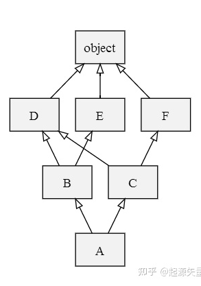

class A:
    def method(self):
        print("CommonA")
class B(A):
    pass
class C(A):
    def method(self):
        print("CommonC")
class D(B, C):
    pass

D().method()

表示类列表 [C_1,C_2,...,C_N] ，
列表的首元素 Head=C_1 
余元素为尾 Tail=C_2...C_N

C+(C_1C_2...C_N)=CC_1C_2...C_N
表示 [C]+[C_1,C_2,...,C_N] 列表的和

L[C(B_1...B_N)]=C+merge(L[B_1]...L[B_N],B_1...B_N)

在这里 merge的运算方式如下：

检查第一个列表的头元素（如 L[B] 的头），记作 H。s
若 H 未出现在 merge 中其它列表的尾部，则将其输出，并将其从所有列表中删除，然后回到步骤 1；否则，取出下一个列表的头部记作 H，继续该步骤。

